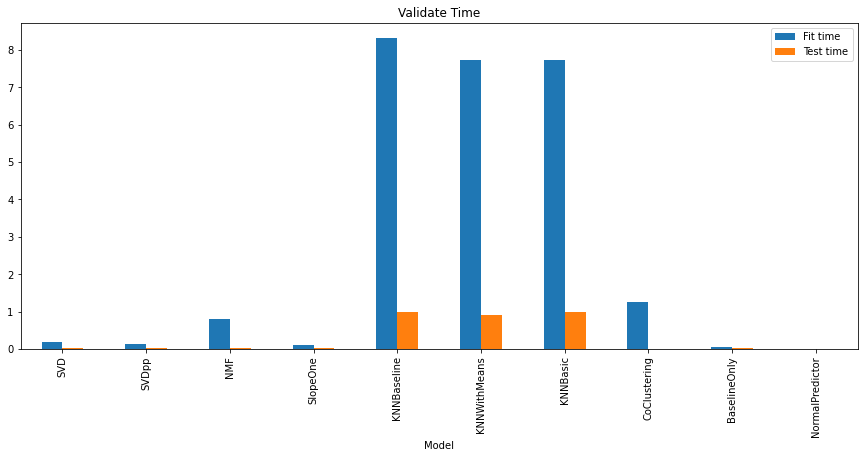
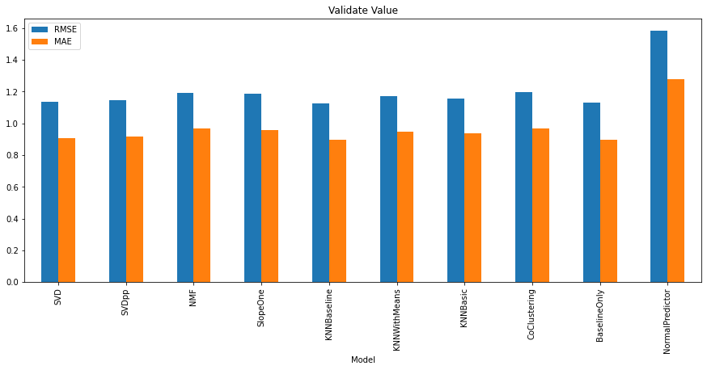

# Bài toán hệ thống gợi ý dựa trên nhiều thuật toán học máy với dữ liệu của Nexflix được lấy từ kaggle (link data có trong file .ipynb)
- Trong phạm vi bài này mình sử dụng data đầu vào có cấu trúc là Cust_ID, Movie_ID, Rating để cho vào model
- Kế đến model sẽ nhận vào một ID người xem tùy ý và một ID phim tùy ý và cho ra ước lượng rating của người dùng đối với phim đó
- Các thuật toán được áp dụng bao gồm SVD, SVDpp, NMF, SlopeOne, các thuật toán dựa trên KNN,...
- Hàm đánh giá các model sẽ là rmse và mae dựa trên hàm cross_validate

# MÔ TẢ DATA
================================================================================
combined_data.txt

CustomerID,Rating,Date

- MovieIDs range from 1 to 17770 sequentially.
- CustomerIDs range from 1 to 2649429, with gaps. There are 480189 users.
- Ratings are on a five star (integral) scale from 1 to 5.
- Dates have the format YYYY-MM-DD.

================================================================================
"movie_titles.txt"

MovieID,YearOfRelease,Title

- MovieID do not correspond to actual Netflix movie ids or IMDB movie ids.
- YearOfRelease can range from 1890 to 2005 and may correspond to the release of
  corresponding DVD, not necessarily its theaterical release.
- Title is the Netflix movie title and may not correspond to 
  titles used on other sites.  Titles are in English.

===============================================================================
"qualifying.txt"

MovieID1:
CustomerID11,Date11
CustomerID12,Date12
...
MovieID2:
CustomerID21,Date21
CustomerID22,Date22

================================================================================
"probe.txt"

MovieID1:
CustomerID11
CustomerID12
...
MovieID2:
CustomerID21
CustomerID22
